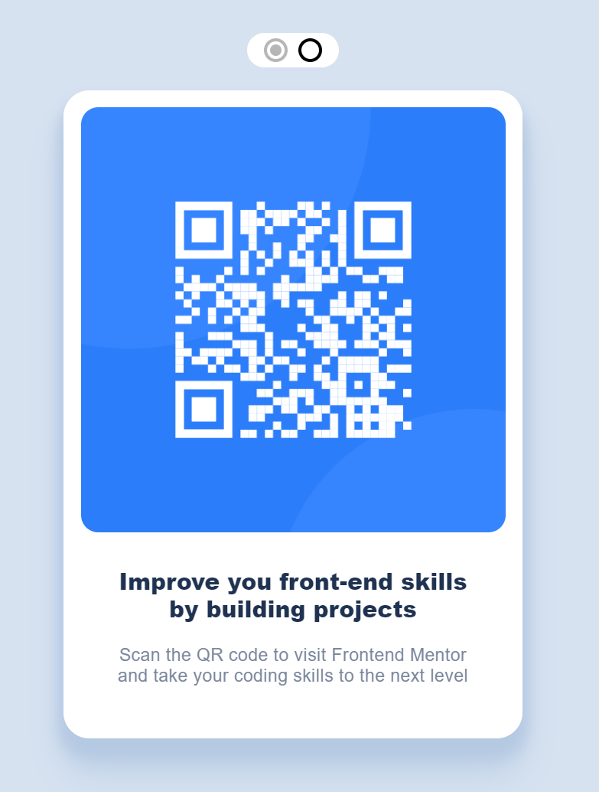

# <a href="https://satrop.github.io/qr-code/">Frontend Mentor - QR code component solution</a>

This is a solution to the [QR code component challenge on Frontend Mentor](https://www.frontendmentor.io/challenges/qr-code-component-iux_sIO_H). Frontend Mentor challenges help you improve your coding skills by building realistic projects.

### Screenshot

 

  

Just testing the water of <a href="#https://www.frontendmentor.io/">Frontend Mentor</a> with this beginner challenge. Added a color switcher at the top for fun, didn't hook the local storage to store the color choice this time.

### Links

-   Solution URL: <a href="https://satrop.github.io/qr-code/">QR Code</a>

## My process

### Built with

-   HTML
-   SCSS with custom properties
-   Flexbox
-   Mobile-first workflow
-   Light / Dark mode

### What I learned

The most interesting thing I've learned is how to use GitHub Pages for these challenges.

### Continued development

For my future projects I'm want to be practising React / TypeScript and Pure JS.

